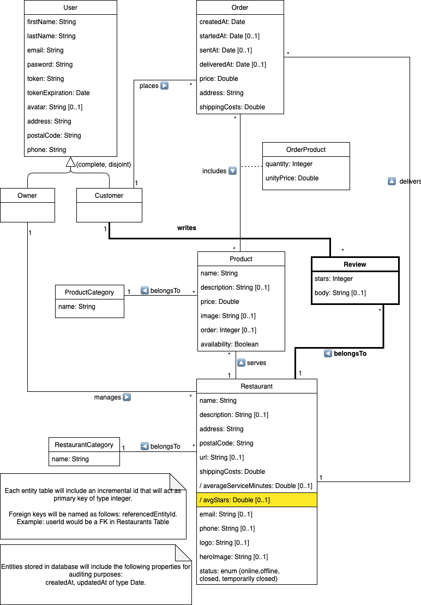

# DeliverUS Exam - Model A - March (Reviews)

Remember that DeliverUS is described at: <https://github.com/IISSI2-IS-2025>

## Exam Statement

A new requirement has been added to the **DeliverUS** application, allowing customers to leave **reviews** for restaurants where they have placed orders. Additionally, the average rating given by customers to restaurants can be consulted.

### What are Reviews?

In **DeliverUS**, **reviews** represent customer ratings for a restaurant. The following conceptual model has been provided:



The following functional requirements need to be implemented:

### **RF1. Listing restaurant reviews**

**As** a user,
**I want** to list the reviews of a restaurant,
**so that** I can see other customers' ratings.

**Route:** `GET /restaurants/:restaurantId/reviews`

**Acceptance tests:**

- Returns an array with all the restaurant's reviews.

    ```Javascript
    [  {
            id: 10001,
            stars: 5,
            body: "Great food!",
            restaurantId: 1,
            customerId: 1,
            createdAt: "2025-03-14T07:54:05.000Z",
            updatedAt: "2025-03-14T07:54:05.000Z",
        },
        {
            id: 1,
            stars: 4,
            body: "The food arrived hot and was very good. I will order again for sure.",
            restaurantId: 1,
            customerId: 1,
            createdAt: "2025-03-14T07:54:03.000Z",
            updatedAt: "2025-03-14T07:54:03.000Z",
        }
    ]
    ```

- If the restaurant has no reviews, returns an empty array.
- Returns `404` if the restaurant does not exist.

---

### **RF2. Creating a review**

**As** a customer,
**I want** to leave a review for a restaurant where I have placed an order,
**so that** I can rate my experience.

**Route:** `POST /restaurants/:restaurantId/reviews`

**Acceptance tests:**

- Returns `401` if the user is not authenticated.
- Returns `403` if the user does not have the customer role.
- Returns `404` if the restaurant does not exist.
- Returns `409` if the user has not placed any orders at the restaurant or if they have already posted a review for that restaurant.
- Returns `422` if the `stars` rating is missing or not between 0 and 5 (inclusive).

---

### **RF3. Editing a review**

**As** a customer,
**I want** to edit my review,
**so that** I can correct or update my opinion.

**Route:** `PUT /restaurants/:restaurantId/reviews/:reviewId`

**Acceptance tests:**

- Returns `401` if the user is not authenticated.
- Returns `403` if the user does not have the customer role or is not the review's creator.
- Returns `404` if the review or restaurant does not exist.
- Returns `409` if the review does not belong to the restaurant.
- Returns `422` if the `stars` rating is missing or not between 0 and 5 (inclusive).

---

### **RF4. Deleting a review**

**As** a customer,
**I want** to delete my review,
**so that** I can remove my opinion if it is no longer relevant.

**Route:** `DELETE /restaurants/:restaurantId/reviews/:reviewId`

**Acceptance tests:**

- Returns `401` if the user is not authenticated.
- Returns `403` if the user does not have the customer role or is not the review's creator.
- Returns `404` if the review or restaurant does not exist.
- Returns `409` if the review does not belong to the restaurant.

---

### **RF5. Calculating the average restaurant rating**

**As** a user,
**I want** to see the average rating of a restaurant,
**so that** I can understand its overall rating.

**Acceptance tests:**

- The virtual attribute `avgStars` should be calculated as the average of all reviews. The JSON object representing the restaurant should have the following structure (note that it includes the `avgStars` property):

    ```Javascript
    {
        id: 101,
        name: "Review Test Restaurant",
        avgStars: 4.5,
        // rest of the restaurant properties
    }
    ```

- If the restaurant has no reviews, `avgStars` should be `null` or `undefined`.

## Exercises

### 1. Migrations, models, and necessary modifications (2 points)

Create and modify the migrations needed to implement the conceptual model, as well as create and modify the necessary models.

Complete the files `/src/database/migrations/20250723214455-create-review.js` and `/src/models/Review.js`, along with any other necessary modifications.

---

### 2. Review Routes (1 point)

Implement the following routes:

- RF1: **GET** `/restaurants/:restaurantId/reviews`
- RF2: **POST** `/restaurants/:restaurantId/reviews`
- RF3: **PUT** `/restaurants/:restaurantId/reviews/:reviewId`
- RF4: **DELETE** `/restaurants/:restaurantId/reviews/:reviewId`

The file `/src/routes/ReviewRoutes.js` is provided to define these routes. Remember to include the necessary middleware in each route.

Note: In `ReviewMiddleware.js`, you will find functions that may be useful for defining routes, and you will complete their implementation in Exercise 5.

---

### 3. Review Validations (1 point)

Implement validation rules for creating and editing a review.
The file `/src/controllers/validation/ReviewValidation.js` is provided for defining these validations.

---

### 4. Review Controller (2 points)

Implement the necessary functions for RF1, RF2, RF3, and RF4.

The file `/src/controllers/ReviewController.js` is provided for defining these functions.

---

### 5. Checking if a customer can create a review (2 points)

Implement the two checks a customer must pass to post a `review`:

1) The customer has placed at least one order at the restaurant they wish to review.
2) The customer has not already posted a review for that restaurant.

The file `/src/middlewares/ReviewMiddleware.js` is provided with the function prototypes `userHasPlacedOrderInRestaurant` and `checkCustomerHasNotReviewed`, which you must implement.

---

### 6. Calculating `avgStars` (2 points)

Implement the logic to calculate the virtual attribute `avgStars` in the function `getAvgStars`, found in `src/models/Restaurant.js`.

You only need to complete this function to ensure the model includes the virtual property—other necessary changes have already been incorporated.

---

### Additional Important Information

- **Routes and validations must be followed exactly as described here, as automated tests rely on these specifications.**
- **Do not modify the tests.** The test file `/tests/e2e/reviews.test.js` explicitly checks the routes, data structures, validations, and associations described above.

## Submission Procedure

1. Delete the **node_modules** folders from the backend.
2. Create a ZIP file that includes the entire project. **Important: Verify that the ZIP is not the same as the one you downloaded and includes your solution.**
3. Inform the instructor before submitting.
4. Once the instructor gives approval, you may upload the ZIP to the Virtual Learning platform. **It is crucial to ensure the platform displays a link to the ZIP before clicking the submit button.** It is recommended to download the ZIP to verify what has been uploaded. After verification, you can submit the exam.

## Environment Setup

### a) Windows

- Open a terminal and run the command: `npm run install:all:win`.

### b) Linux/MacOS

- Open a terminal and run the command: `npm run install:all:bash`.

## Execution

### Backend

- To **recreate migrations and seeders**, open a terminal and run:

    ```Bash
    npm run migrate:backend
    ```

- To **run the backend**, open a terminal and execute:

    ```Bash
    npm run start:backend
    ```

## Debugging

- To **debug the backend**, ensure **NO** instance is running, click the `Run and Debug` button in the sidebar, select `Debug Backend` from the dropdown list, and press *Play*.

## Testing

- To check backend functionality, run:

    ```Bash
    npm run test:backend
    ```

**Warning: Tests cannot be modified.**
