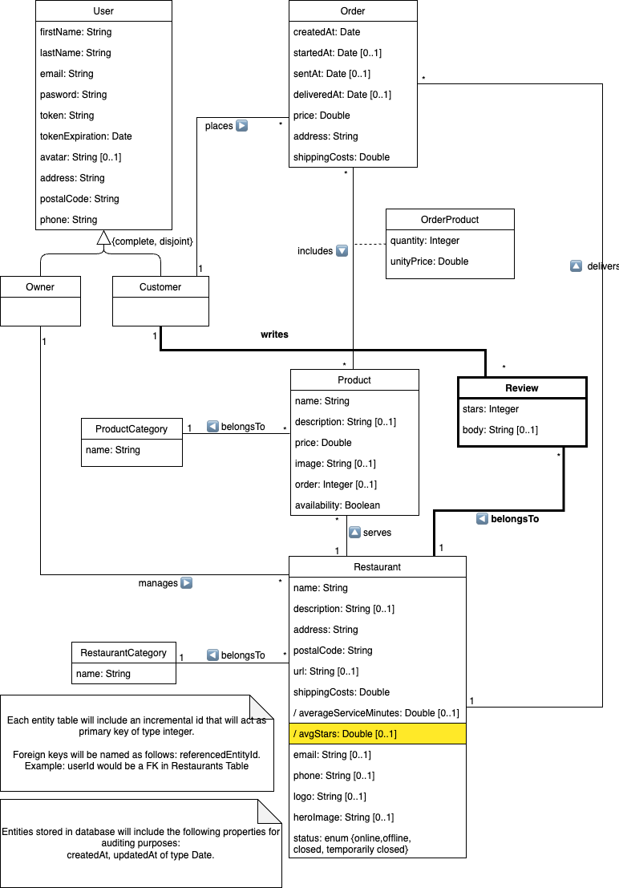

# Examen DeliverUS - Modelo A - Marzo (Reviews)

Recuerde que DeliverUS está descrito en: <https://github.com/IISSI2-IS-2025>

## Enunciado del examen

Se ha incorporado un nuevo requisito en la aplicación **DeliverUS**, que permite a los clientes dejar **reviews** sobre los restaurantes en los que han realizado pedidos. Además se podrá consultar la valoración media que los clientes tienen sobre los restaurantes.

### ¿Qué son las Reviews?

En **DeliverUS**, las **reviews** representan la valoración de los clientes sobre un restaurante. Se nos ha proporcionado el siguiente modelado conceptual:



Es necesaria la implementación de los siguientes requisitos funcionales:

### **RF1. Listado de reviews de un restaurante**

**Como** usuario,
**quiero** listar las reviews de un restaurante,
**para** ver las valoraciones de otros clientes.

**Ruta:** `GET /restaurants/:restaurantId/reviews`

**Pruebas de aceptación:**

- Devuelve un array con todas las reviews del restaurante.

    ```Javascript
    [  {
            id: 10001,
            stars: 5,
            body: "Great food!",
            restaurantId: 1,
            customerId: 1,
            createdAt: "2025-03-14T07:54:05.000Z",
            updatedAt: "2025-03-14T07:54:05.000Z",
        },
        {
            id: 1,
            stars: 4,
            body: "La comida llegó caliente y estaba muy buena. Repetiré seguro.",
            restaurantId: 1,
            customerId: 1,
            createdAt: "2025-03-14T07:54:03.000Z",
            updatedAt: "2025-03-14T07:54:03.000Z",
        }
    ]
    ```

- Si el restaurante no tiene reviews, devuelve un array vacío.
- Devuelve código `404` si el restaurante no existe.

---

### **RF2. Creación de una review**

**Como** cliente,
**quiero** dejar una review en un restaurante en el que haya pedido,
**para** valorar mi experiencia.

**Ruta:** `POST /restaurants/:restaurantId/reviews`

**Pruebas de aceptación:**

- Devuelve código `401` si el usuario no está autenticado.
- Devuelve código `403` si el usuario no tiene rol de cliente.
- Devuelve código `404` si el restaurante no existe.
- Devuelve código `409` si el usuario no ha realizado pedidos en el restaurante o ya existe una review para ese restaurante de ese usuario.
- Devuelve código `422` si la puntuación `stars` no está presente o no está entre 0 y 5 (inclusives).

---


### **RF3. Edición de una review**

**Como** cliente,
**quiero** poder editar mi review,
**para** corregir o actualizar mi opinión.

**Ruta:** `PUT /restaurants/:restaurantId/reviews/:reviewId`

**Pruebas de aceptación:**

- Devuelve código `401` si el usuario no está autenticado.
- Devuelve código `403` si el usuario no tiene rol de cliente o no es el creador de la review.
- Devuelve código `404` si la review o el restaurante no existen.
- Devuelve código `409` si la review no pertenece al restaurante.
- Devuelve código `422` si la puntuación `stars` no está presente o no está entre 0 y 5 (inclusives).

---

### **RF4. Eliminación de una review**

**Como** cliente,
**quiero** poder eliminar mi review,
**para** retirar mi opinión si ya no es relevante.

**Ruta:** `DELETE /restaurants/:restaurantId/reviews/:reviewId`

**Pruebas de aceptación:**

- Devuelve código `401` si el usuario no está autenticado.
- Devuelve código `403` si el usuario no tiene rol de cliente o no es el creador de la review.
- Devuelve código `404` si la review o el restaurante no existen.
- Devuelve código `409` si la review no pertenece al restaurante.

---

### **RF5. Cálculo de la media de estrellas de un restaurante**

**Como** usuario,
**quiero** ver la media de puntuaciones de un restaurante,
**para** conocer su valoración general.

**Pruebas de aceptación:**

- El atributo virtual `avgStars` debe calcularse como el promedio de todas las reviews. El objeto json que representa al restaurante tendrá la forma siguiente (nótese que se incluye la propiedad `avgStars`)

    ```Javascript
    {
        id: 101,
        name: "Review Test Restaurant",
        avgStars: 4.5,
        // rest of the restaurante properties
    }
    ```

- Si el restaurante no tiene reviews, `avgStars` debe ser `null` o `undefined`.

## Ejercicios

### 1. Migraciones, modelos y cambios necesarios (2 puntos)

Cree y modifique las migraciones necesarias para implementar el modelado conceptual así como cree y modifique los modelos necesarios.

Complete los ficheros `/src/database/migrations/20250723214455-create-review.js` y `/src/models/Review.js`, además de las modificaciones necesarias sobre otros ficheros.

---

### 2. Rutas de Review (1 punto)

Implemente las siguientes rutas:

- RF1: **GET** `/restaurants/:restaurantId/reviews`
- RF2: **POST** `/restaurants/:restaurantId/reviews`
- RF3: **PUT** `/restaurants/:restaurantId/reviews/:reviewId`
- RF4: **DELETE** `/restaurants/:restaurantId/reviews/:reviewId`

Se le proporciona el fichero /src/routes/ReviewRoutes.js para definir estas rutas y recuerde incorporar los middlewares necesarios en cada ruta.

Nota: en `ReviewMiddleware.js' encontrará funciones que le pueden ser útiles para definir las rutas y completará su implementación en el ejercicio 5.

---

### 3. Validaciones para Review (1 puntos)

Implemente las reglas de validación para la creación y la edición de una review.
Se le proporciona el fichero `/src/controllers/Validation/ReviewValidation.js` para definir estas validaciones.


---

### 4. Controlador de Review (2 puntos)

Implemente las funciones necesarias para RF1, RF2, RF3 y RF4.

Se le proporciona el fichero `/src/controllers/ReviewController.js` para definir estas funciones.


---

### 5. Comprobación de que el cliente puede crear una review (2 puntos)

Implemente las dos comprobaciones que un cliente debe cumplir para publicar una `review`, esto es:

1) Tiene al menos un pedido en el restaurante que desea revisar
2) No tiene ya una revisión publicada para ese restaurante.

Se le proporciona el fichero `/src/middlewares/ReviewMiddleware.js` con los prototipos para sendas funciones `userHasPlacedOrderInRestaurant`, `checkCustomerHasNotReviewed` que ha de implementar.

### 6. Cálculo de `avgStars` (2 puntos)

Implemente la lógica para calcular el atributo virtual `avgStars` en la función `getAvgStars` que encontrará en `src/models/Restaurant.js`.

Sólo es necesario completar esta función para que el modelo incluya la propiedad virtual, el resto de cambios necesarios ya están incorporados.

---

### Información adicional importante

- **Las rutas y validaciones deben respetarse exactamente como aquí se describen, ya que los tests automáticos se basan en estas especificaciones.**
- **No modificar los tests.** El fichero de test `/tests/e2e/reviews.test.js` se comprueban explícitamente las rutas, estructuras de datos, validaciones y asociaciones descritas anteriormente.

## Procedimiento de entrega

1. Borrar las carpetas **node_modules** de backend.
1. Crear un ZIP que incluya todo el proyecto. **Importante: Comprueba que el ZIP no es el mismo que te has descargado e incluye tu solución**
1. Avisa al profesor antes de entregar.
1. Cuando el profesor te dé el visto bueno, puedes subir el ZIP a la plataforma de Enseñanza Virtual. **Es muy importante esperar a que la plataforma te muestre un enlace al ZIP antes de pulsar el botón de enviar**. Se recomienda descargar ese ZIP para comprobar lo que se ha subido. Un vez realizada la comprobación, puedes enviar el examen.

## Preparación del entorno

### a) Windows

- Abra un terminal y ejecute el comando `npm run install:all:win`.

### b) Linux/MacOS

- Abra un terminal y ejecute el comando `npm run install:all:bash`.

## Ejecución

### Backend

- Para **rehacer las migraciones y seeders**, abra un terminal y ejecute el comando

    ```Bash
    npm run migrate:backend
    ```

- Para **ejecutarlo**, abra un terminal y ejecute el comando

    ```Bash
    npm run start:backend
    ```

## Depuración

- Para **depurar el backend**, asegúrese de que **NO** existe una instancia en ejecución, pulse en el botón `Run and Debug` de la barra lateral, seleccione `Debug Backend` en la lista desplegable, y pulse el botón de *Play*.

## Test

- Para comprobar el correcto funcionamiento de backend puede ejecutar el conjunto de tests incluido a tal efecto. Para ello ejecute el siguiente comando:

    ```Bash
    npm run test:backend
    ```

**Advertencia: Los tests no pueden ser modificados.**

## Problemas con los puertos

En ocasiones, los procesos de backend, con o sin depuración, puede quedarse bloqueado sin liberar los puertos utilizados, impidiendo que puedan ejecutarse otros procesos. Se recomienda cerrar y volver a iniciar VSC para cerrar dichos procesos.
